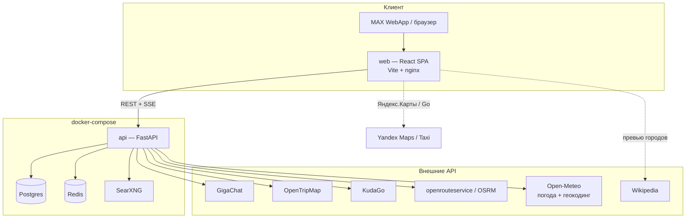
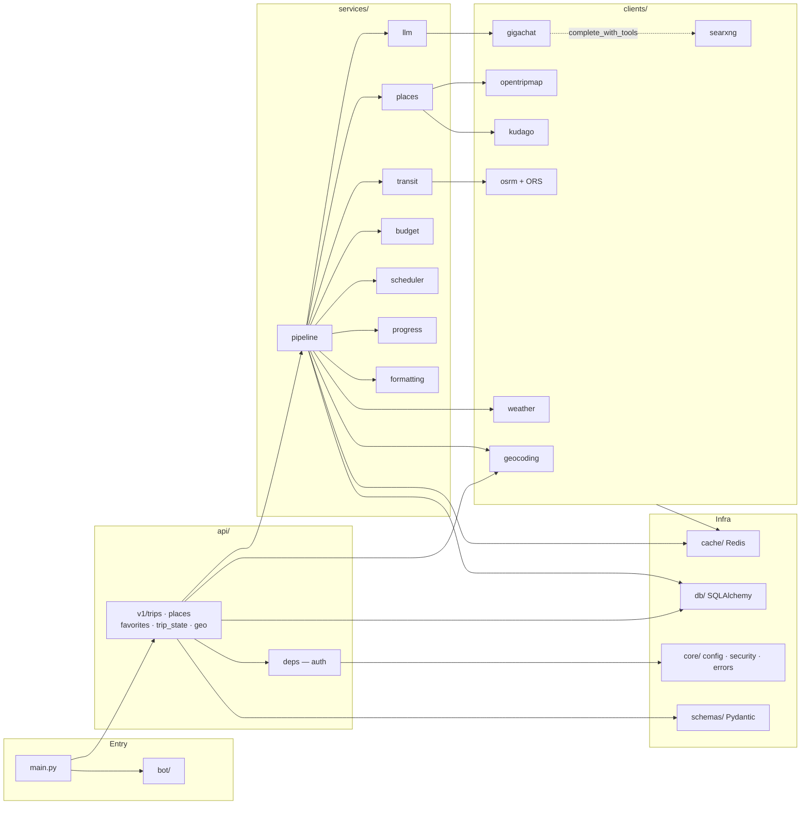
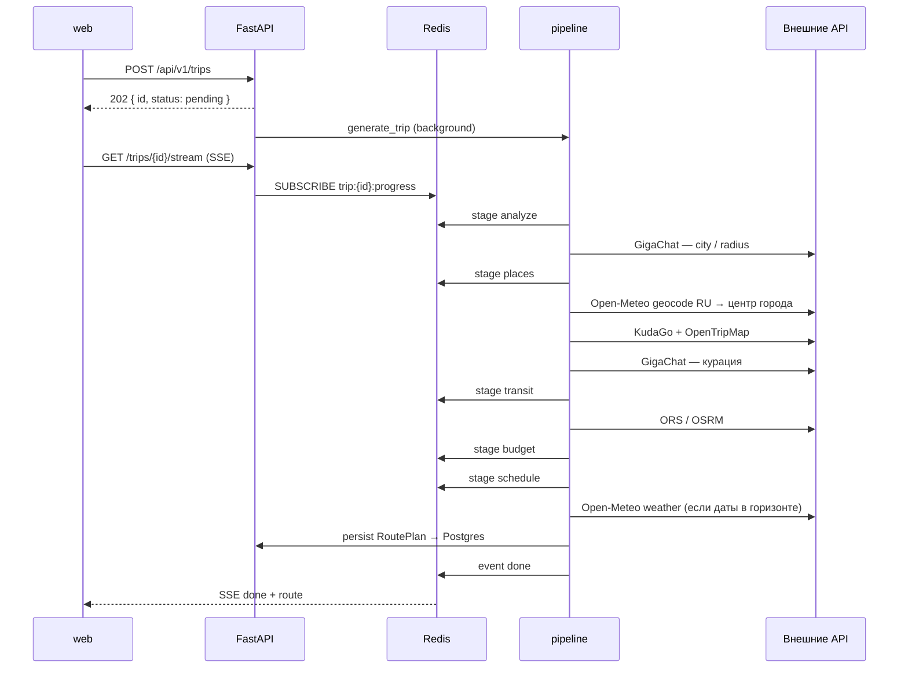
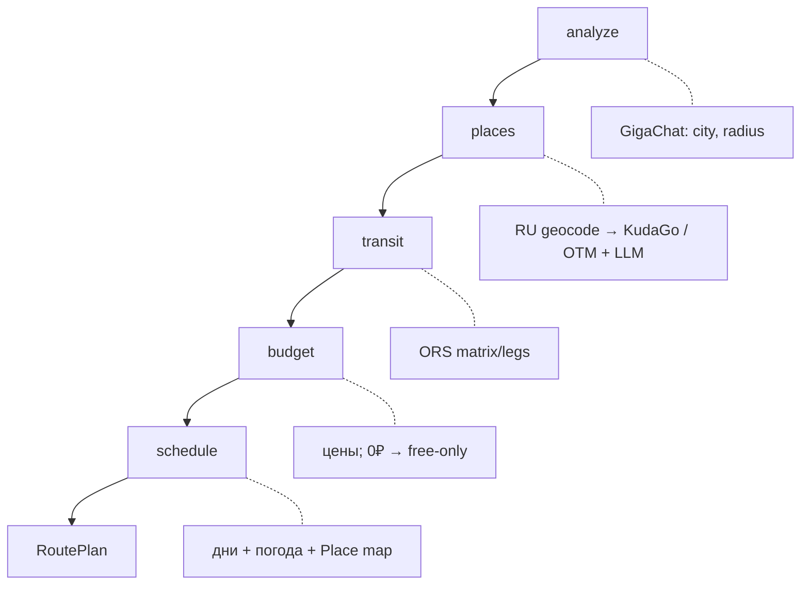
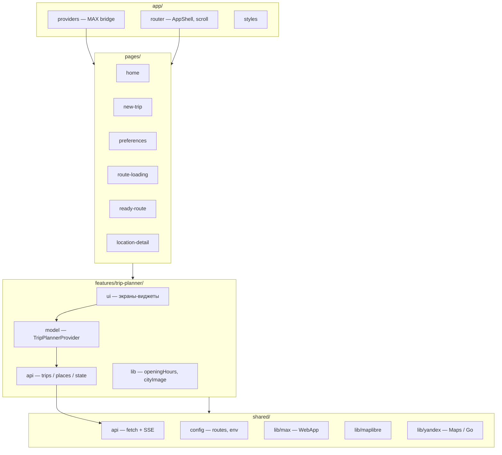
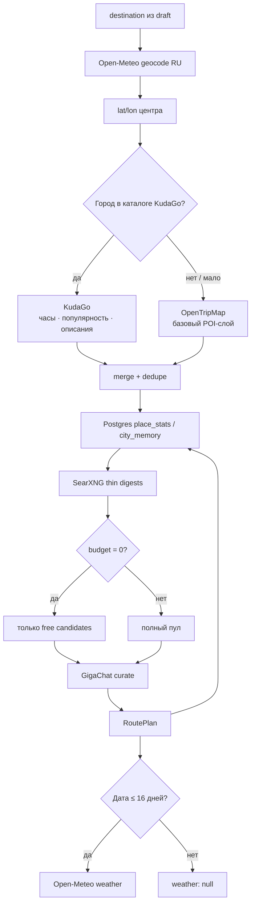

# Архитектура 2РИСТ

Мини-приложение для MAX: пользователь задаёт город, даты и интересы → бэкенд
собирает маршрут по дням и стримит прогресс по SSE → фронт показывает план,
карту, бюджет и сборы.

---

## Общая схема



| Контейнер | Роль |
| --------- | ---- |
| `web` | собранный SPA за nginx |
| `api` | FastAPI, миграции Alembic, uvicorn |
| `postgres` | поездки, места, избранное, packing / ledger |
| `redis` | кеш внешних ответов, pub/sub прогресса SSE, квоты |
| `searxng` | локальный веб-поиск для tool-calling GigaChat (demo / инфра) |

SearXNG по умолчанию слушает только `127.0.0.1:8081` на хосте; API ходит к нему
по внутренней сети (`SEARXNG_URL=http://searxng:8080`).

---

## Модули бэкенда



### Назначение модулей

| Модуль | Что делает |
| ------ | ---------- |
| `app/main.py` | lifespan, CORS, роутеры, health |
| `app/api/v1/` | HTTP: поездки, SSE, места, избранное, state, подсказки городов |
| `app/api/deps.py` | пользователь из MAX `initData` (или `AUTH_MODE=dev`) |
| `app/services/pipeline.py` | оркестратор 5 стадий генерации маршрута |
| `app/services/places.py` | кандидаты: KudaGo → OpenTripMap, дедуп, категории |
| `app/services/llm.py` | нормализация города и отбор мест через GigaChat |
| `app/services/scheduler.py` | раскладка мест по дням с учётом темпа |
| `app/services/transit.py` | ноги между точками, режим пешком/метро/такси |
| `app/services/budget.py` | оценка цен + флаг `priceEstimated`; `0 ₽` = только бесплатное |
| `app/services/progress.py` | публикация стадий в Redis pub/sub |
| `app/clients/geocoding.py` | подсказки городов и coords через Open-Meteo (RU-first) |
| `app/clients/searxng.py` | JSON-поиск для `web_search` tool GigaChat |
| `app/clients/*` | HTTP-клиенты внешних API |
| `app/function_schema.py` | схема function calling `web_search` |
| `app/cache/` | ключи, TTL, декоратор `cached_json`, квота OTM |
| `app/db/` | модели, сессия, репозитории |
| `app/schemas/` | контракт с фронтом (camelCase) |
| `app/bot/` | MAX-бот: platform-api2 client, open_app, webhook / long polling |
| `app/core/` | настройки, логирование, ошибки, security |

---

## Пайплайн генерации маршрута

Стадии совпадают с `LOADING_STEPS` на фронте и стримятся по SSE.





### Геокодинг центра города

Автокомплит (`GET /api/v1/geo/cities`) и пайплайн используют **один источник** —
Open-Meteo Geocoding с `countryCode=RU` и фильтром «trip-worthy» городов
(админцентры / население). Координаты вне приблизительного bbox России
отбрасываются, чтобы латинский `geoQuery` от LLM не уводил маршрут в Африку
через OpenTripMap `geoname`. OTM geoname — запасной вариант после Open-Meteo.

### Бюджет

| Ввод | Поведение |
| ---- | --------- |
| `budget > 0` | типичные цены по категории масштабируются под бюджет |
| `budget = 0` | только бесплатные места (парки, площади, памятники); лейбл `0 ₽` |

`0` — осознанный «бесплатный» режим, а не «бюджет не указан».

---

## Модули фронтенда

Feature-Sliced-подобная раскладка: экраны тонкие, логика в `features/trip-planner`.



### Экраны → ответственность

| Страница | Модуль | Роль |
| -------- | ------ | ---- |
| `/` | `pages/home` | список поездок + избранное |
| `/trips/new` | `pages/new-trip` | новая поездка (город…) или `?tripId=` — правка параметров без города (даты, бюджет, состав, интересы, темп) |
| `/preferences` | `pages/preferences` | интересы, темп → `POST /trips` |
| `/loading` | `pages/route-loading` | SSE-прогресс; при ошибке — retry **или** на главную |
| `/route?tripId=&day=` | `pages/ready-route` | дни, карта, сборы, бюджет; меню ⋮ (правка / удаление) |
| `/places/:id` | `pages/location-detail` | карточка; нижний крестик → назад к маршруту |

### Внутри `features/trip-planner`

| Слой | Примеры | Роль |
| ---- | ------- | ---- |
| `model/` | `TripPlannerProvider`, `types`, `useTripLocalState` | глобальный стейт поездки + локальный packing/ledger |
| `api/` | `trips.ts`, `places.ts`, `state.ts` | типизированные вызовы бэка |
| `ui/` | `DayTabs`, `CityField`, `PlaceDetails`, `StatusView`… | переиспользуемые виджеты |
| `lib/` | `openingHours`, `cityImage`, `format` | чистые хелперы без React |

При открытии поездки `openTrip` подтягивает `activeTripDraft` с сервера — UI
бюджета совпадает с тем, что реально генерировали. Wizard-`draft` при этом не
трогается: после успешной генерации форма сбрасывается, чтобы «Новая поездка»
начиналась с чистых полей. Активный день живёт в `?day=`, чтобы выход из карточки
места не сбрасывал на «День 1».

Deeplink’и: `shared/lib/yandex` — точка на карте (`ll`/`pt`), маршрут пешком/метро,
Yandex Go с координатами A→B.

---

## Данные и кеш

```mermaid
flowchart LR
  subgraph Persist["Postgres"]
    U[users]
    T[trips + route_plan JSON]
    P[places]
    F[favorites]
    L[ledger / packing state]
    A[audit_events]
    M[place_stats / city_memory]
  end

  subgraph Cache["Redis"]
    K1[otm:* · kudago:*]
    K2[osrm:* · weather:*]
    K3[gigachat:* · trip:plan:*]
    K4[geo:city:* · geo:coords:*]
    K5[searxng:*]
    K6[trip:{id}:progress / events]
    K7[otm:quota:YYYY-MM-DD]
  end

  API[FastAPI] --> Persist
  API --> Cache
```

Ответы внешних API кешируются с длинными TTL, чтобы не жечь бесплатные квоты.
Прогресс генерации живёт в pub/sub + replay-логе, чтобы поздний SSE-подписчик
всё равно увидел стадии.

---

## Источники данных (обогащение)



| Источник | Ключ | Роль |
| -------- | ---- | ---- |
| Open-Meteo Geocoding | нет | автокомплит городов + центр маршрута (RU) |
| KudaGo | нет | приоритет для 12 городов |
| OpenTripMap | да | фолбэк / дополнение POI |
| GigaChat | да | город + отбор мест; опционально tools + SearXNG |
| SearXNG | нет | thin digests в stage `places` + demo tool-loop |
| Postgres `place_stats` / `city_memory` | — | first-party память после успешного RoutePlan (не кэш) |
| openrouteservice | да | время в пути (фолбэк OSRM) |
| Open-Meteo Forecast | нет | погода по дням |
| Wikipedia | нет | превью города на главной (клиент) |

`complete_with_tools` + `scripts/gigachat_search_demo.py` — демо tool-loop.
В пайплайне SearXNG даёт короткие discovery hints; полные HTML-страницы в СУБД не пишутся.

---

## Контракт API (кратко)

```text
POST   /api/v1/trips                 создать задачу генерации
GET    /api/v1/trips                 список поездок пользователя
GET    /api/v1/trips/{id}            статус + draft + RoutePlan
GET    /api/v1/trips/{id}/edit       параметры формы без города
PATCH  /api/v1/trips/{id}            изменить параметры и пересобрать маршрут
DELETE /api/v1/trips/{id}            архивировать (soft-hide)
GET    /api/v1/trips/{id}/stream     SSE: stage | done | error
POST   /api/v1/trips/{id}/retry      перезапуск
GET    /api/v1/geo/cities?q=         подсказки городов (RU)
GET    /api/v1/places/{id}           карточка места
GET/POST/DELETE /api/v1/favorites   избранное
GET/PUT /api/v1/trips/{id}/state     packing + ledger
GET/POST/DELETE …/ledger            учёт трат
GET    /api/v1/bot/status            статус MAX-бота
POST   /api/v1/bot/invite            клавиатура-инвайт (в production — secret)
POST   /api/v1/bot/webhook           webhook MAX
```

`/api/v1` защищён fixed-window rate limit на Redis (429 `rate_limited`;
вебхук бота и `/health` — вне лимита).

Схемы — `backend/app/schemas/trip.py`, зеркалят `web/.../model/types.ts`
(сериализация camelCase).

---

## Деплой стенда (кратко)

Прод-стенд на VDS обновляется **pull-based**: таймер на машине тянет `main` и
пересобирает compose. GitHub Actions на push в `main` только фиксирует факт
деплоя / health (SSH с Actions до VDS недоступен). Домены и TLS — снаружи
compose (Caddy + сертификаты).
