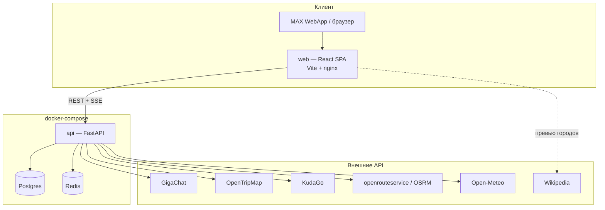
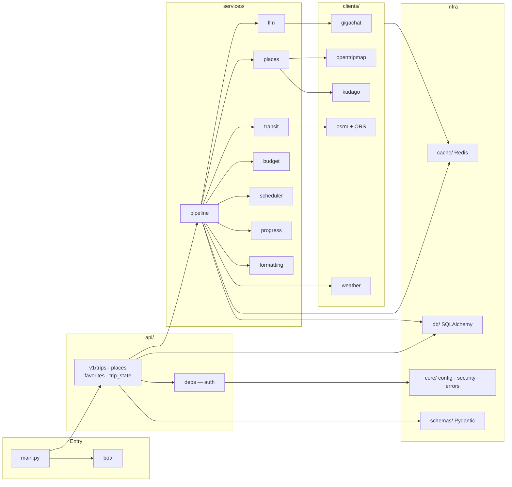
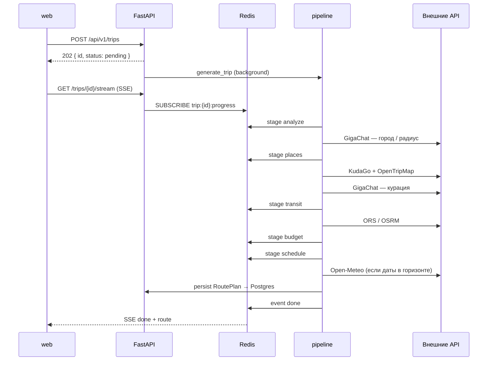
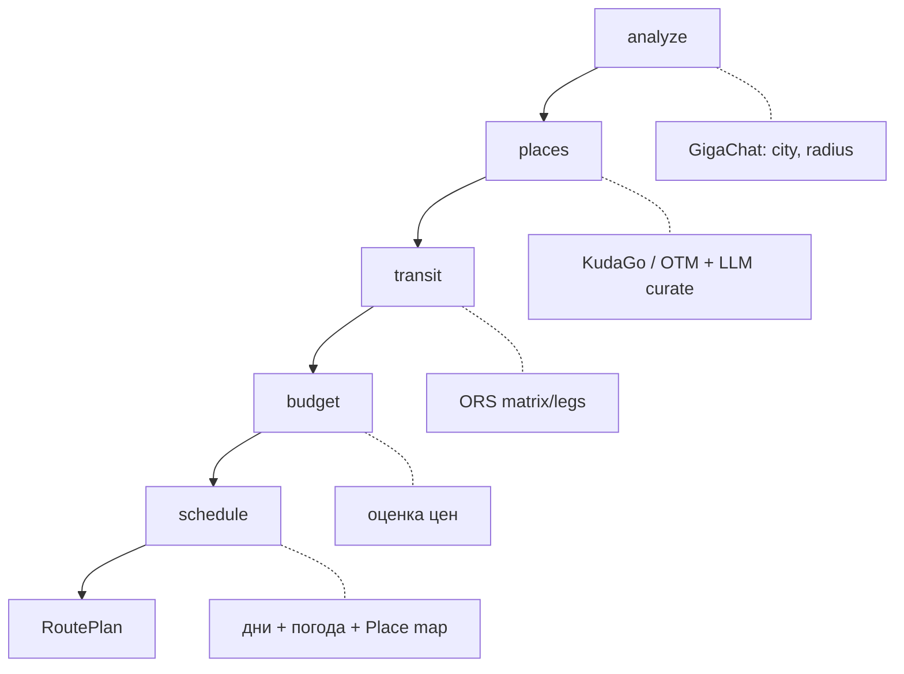
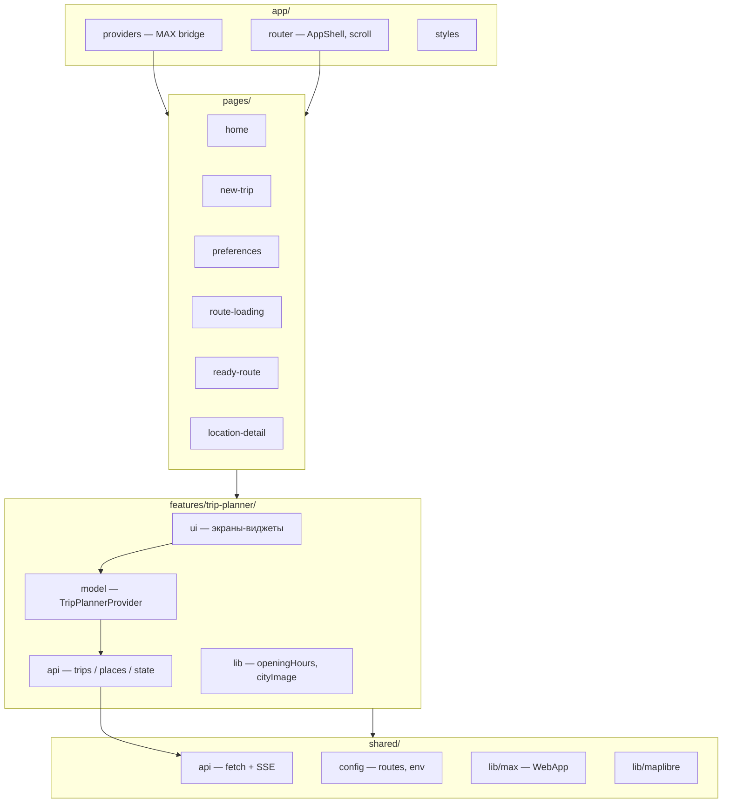
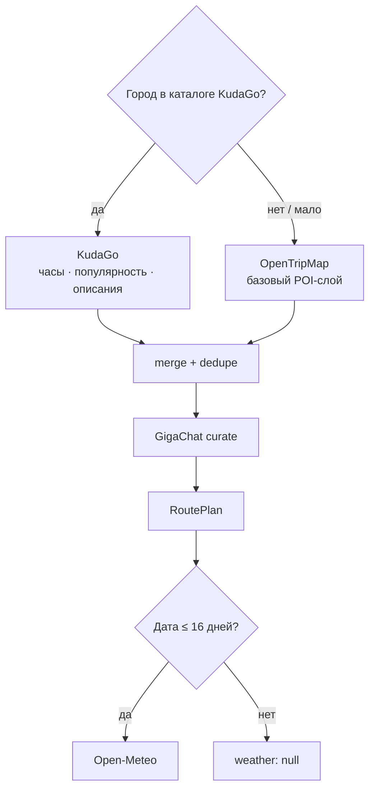

# Архитектура Trip Planner

Мини-приложение для MAX: пользователь задаёт город, даты и интересы → бэкенд
собирает маршрут по дням и стримит прогресс по SSE → фронт показывает план,
карту, бюджет и сборы.

---

## Общая схема



| Контейнер | Роль |
| --------- | ---- |
| `web` | собранный SPA за nginx |
| `api` | FastAPI, миграции Alembic, uvicorn |
| `postgres` | поездки, места, избранное, ledger |
| `redis` | кеш внешних ответов, pub/sub прогресса SSE, квоты |

---

## Модули бэкенда



### Назначение модулей

| Модуль | Что делает |
| ------ | ---------- |
| `app/main.py` | lifespan, CORS, роутеры, health |
| `app/api/v1/` | HTTP: создание поездки, SSE-стрим, места, избранное, локальный state |
| `app/api/deps.py` | пользователь из MAX `initData` (или `AUTH_MODE=dev`) |
| `app/services/pipeline.py` | оркестратор 5 стадий генерации маршрута |
| `app/services/places.py` | кандидаты: KudaGo → OpenTripMap, дедуп, категории |
| `app/services/llm.py` | нормализация города и отбор мест через GigaChat |
| `app/services/scheduler.py` | раскладка мест по дням с учётом темпа |
| `app/services/transit.py` | ноги между точками, режим пешком/метро/такси |
| `app/services/budget.py` | оценка цен + флаг `priceEstimated` |
| `app/services/progress.py` | публикация стадий в Redis pub/sub |
| `app/clients/*` | HTTP-клиенты внешних API |
| `app/cache/` | ключи, TTL, декоратор `cached_json`, квота OTM |
| `app/db/` | модели, сессия, репозитории |
| `app/schemas/` | контракт с фронтом (camelCase) |
| `app/bot/` | MAX-бот: platform-api2 client, open_app, webhook / long polling |
| `app/core/` | настройки, логирование, ошибки, security |

---

## Пайплайн генерации маршрута

Стадии совпадают с `LOADING_STEPS` на фронте и стримятся по SSE.





---

## Модули фронтенда

Feature-Sliced-подобная раскладка: экраны тонкие, логика в `features/trip-planner`.



### Экраны → ответственность

| Страница | Модуль | Роль |
| -------- | ------ | ---- |
| `/` | `pages/home` | список поездок + избранное |
| `/trips/new` | `pages/new-trip` | черновик: город, даты, бюджет |
| `/preferences` | `pages/preferences` | интересы, темп → `POST /trips` |
| `/loading` | `pages/route-loading` | SSE-прогресс генерации |
| `/route` | `pages/ready-route` | дни, карта, сборы, бюджет |
| `/places/:id` | `pages/location-detail` | карточка места |

### Внутри `features/trip-planner`

| Слой | Примеры | Роль |
| ---- | ------- | ---- |
| `model/` | `TripPlannerProvider`, `types`, `useTripLocalState` | глобальный стейт поездки + локальный packing/ledger |
| `api/` | `trips.ts`, `places.ts`, `state.ts` | типизированные вызовы бэка |
| `ui/` | `DayTabs`, `DayWeatherBadge`, `PlaceDetails`, `SoftImage`… | переиспользуемые виджеты |
| `lib/` | `openingHours`, `cityImage`, `format` | чистые хелперы без React |

---

## Данные и кеш

```mermaid
flowchart LR
  subgraph Persist["Postgres"]
    U[users]
    T[trips + route_plan JSON]
    P[places]
    F[favorites]
    L[ledger / packing state]
  end

  subgraph Cache["Redis"]
    K1[otm:* · kudago:*]
    K2[osrm:* · weather:*]
    K3[gigachat:* · trip:plan:*]
    K4[trip:{id}:progress / events]
    K5[otm:quota:YYYY-MM-DD]
  end

  API[FastAPI] --> Persist
  API --> Cache
```

Ответы внешних API кешируются с длинными TTL, чтобы не жечь бесплатные квоты.
Прогресс генерации живёт в pub/sub + replay-логе, чтобы поздний SSE-подписчик
всё равно увидел стадии.

---

## Источники данных (обогащение)



| Источник | Ключ | Роль |
| -------- | ---- | ---- |
| KudaGo | нет | приоритет для 12 городов |
| OpenTripMap | да | фолбэк / дополнение |
| GigaChat | да | город + отбор мест |
| openrouteservice | да | время в пути (фолбэк OSRM) |
| Open-Meteo | нет | погода по дням |
| Wikipedia | нет | превью города на главной (клиент) |

---

## Контракт API (кратко)

```text
POST   /api/v1/trips                 создать задачу генерации
GET    /api/v1/trips                 список поездок пользователя
GET    /api/v1/trips/{id}            статус + RoutePlan
GET    /api/v1/trips/{id}/stream     SSE: stage | done | error
POST   /api/v1/trips/{id}/retry      перезапуск
GET    /api/v1/places/{id}           карточка места
GET/POST/DELETE /api/v1/favorites   избранное
GET/PUT /api/v1/trips/{id}/state     packing + ledger
```

Схемы — `backend/app/schemas/trip.py`, зеркалят `web/.../model/types.ts`
(сериализация camelCase).
